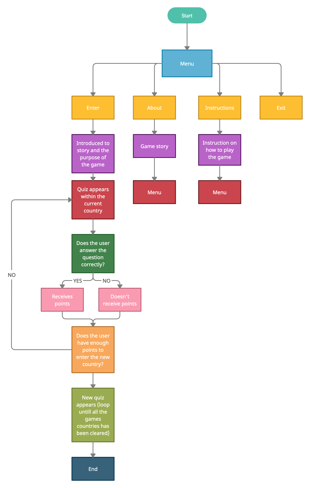
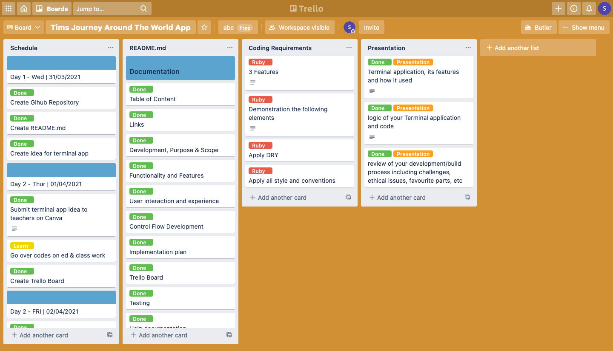

# Software Development Plan - Tim's Journey Around the World

## Purpose & Scope

### **Purpose:** 

Tim is set on an adventure to explore the vast world we live in. We follow Tim as he discovers places he has never been but do you know what it is? The game is a fun Geography terminal application game, to test our knowledge on how much do we know about our world. Players are given questions on the country they are in and earn points to proceed to the next country. 

### **Problem:**

Many people know that specifically the people from the US, they are known to be bad in geography. As of early 2020 A recent poll found only 28% (*Morning Consult US*) of registered voters could pick out Iran on a map. Since its considered "When will I need this in my life?", not just the US that many people struggle with Geography but there are many of us that still don't know where The Stonehenge is located for example.Tim's Journey Around the World solve this problem by helping users understand the uniqueness of places, as well as of the similarities between them.

### **Target Audience:**

Tim's Journey Around the World will be enjoyed by everyone. Given the topic is not overly complicated and fun at the same time was designed for personal entertainment. Moreover, this application may very be used for educational purpose as it is user friendly and the theme circulates a kids theme.

### **Target Audience Usage:**

Tim's Journey Around the World will be launched from the command line using the files listed in the installation section of this README.md document. 


#

## Functionality and Features

1. Geography quiz that rewards points on correct answers 

- Each time a question appears, users are to give the the correct answer to receive points. With enough points, the user can proceed to the next area (country) and so on. The game finishes when the terminal says "You have traveled around the world with Tim!"


2. Recording user sessions so users can return to the game

- Users can save their current session and leave so when they come back, they are able to continue where they left off.
 
3. Sound Effects

- Sound Effects will be played throughout the application, when user get answer correct or false. It will also display the sound when the user enters a new country with with enough points accumulated. 

# 

## User interaction and experience

The user is displayed with the menu screen which they are able to select one of the options and will be directed  to the appropriate area.

When the user may want to know how to play the game before playing, so they will select the "Instructions" option. The user twill be directed to an instructions line clearing the previous command line. 

Once the user is ready to play, they will return to the menu and select the "Start" option. At the start of the game the user is greeted by Tim who he will start the game.

The user will receive 4 questions in each country they are in. Each questions answered correctly will give the player a point and once the player have 3 or more points, they can proceed to the next area. If not they are to restart the level again. When the player reach the end of the game after 4 areas, the terminal will close. 


#

# Control Flow


#

## Implementation plan

Once my concept was accepted, I built a Trello board to help me break down the major components of the assignment requirements: documentation, coding, and presentation. The Trello board contains a schedule for the upcoming days of activities that I have divided into various categories to help me control my workload. Once setting up the Trello Board, I was then able to have a concrete plan and idea on what to expect of my terminal application will be without any side tracks. By implementing the flow chart as well as the Trello board, I was able to stay on track to finish this before the deadline by allocating each work to my schedule and marking it as completed.

### [Trello Board](https://trello.com/b/Y1djURrA/tims-journey-around-the-world-app)



#

## Testing 

Testing were done however, there were minor issues which couldn't display anything from the code.

#
## Help documentation

## Install the application

- If you do not have Ruby on your computer, follow these instructions to [download and install](https://www.Gunyo.org/en/documentation/installation/)

- Clone the project files onto your computer from the source code here: https://github.com/Gunyo/ATA3-Tims_Journey_Around_The_World

- On the terminal command line, navigate to the ATA3-Tims_Journey_Around_The_World directory you have just cloned.
- If you do not have the 'bundler' gem installed on your computer, please enter the following code.
 
```ruby
$ install bundler
```
- In the terminal type in the below folders 

```ruby
cd src/game_menu
```
- To activate the game enter the below. Make sure your volume is turned on for more personalised experience. 


```ruby
ruby game_menu.rb
```
## Dependencies 

Words of fortune utilise the following gems that are  Mac dependent and will not function on other operating systems.

The following Ruby Gems are required and are included in the Gemfile.

- gem "colorize", "~> 0.8.1"

- gem "tty", "~> 0.7.0"

#