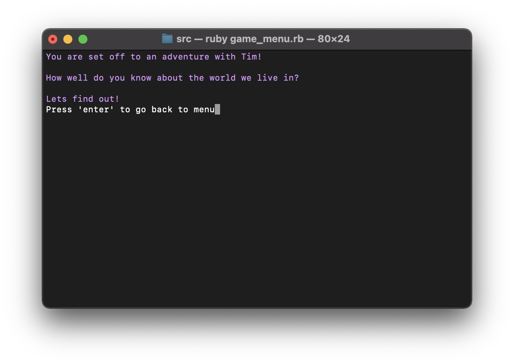
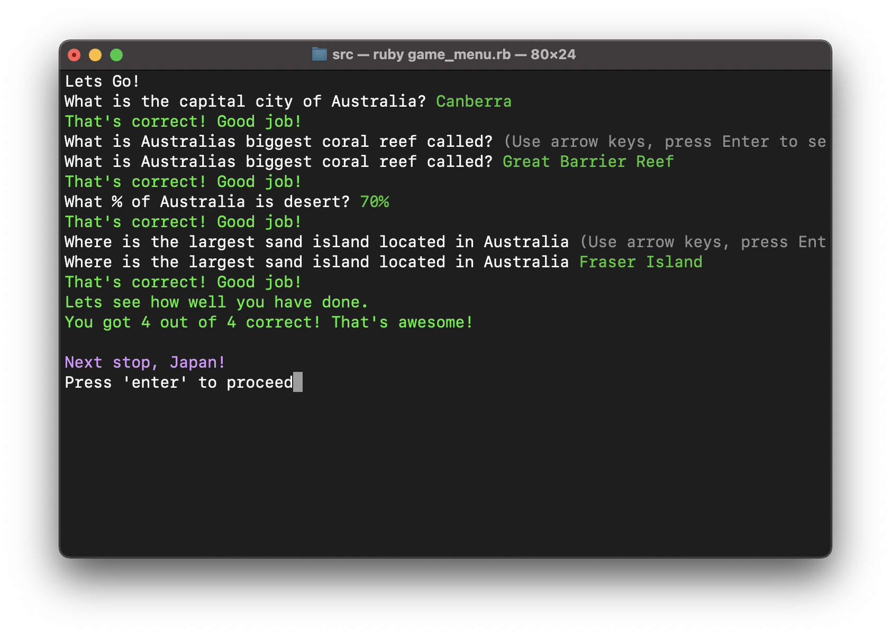

# Software Development Plan - Tim's Journey Around the World

## Purpose & Scope

### **Purpose:** 

Tim is set on an adventure to explore the vast world we live in. We follow Tim as he discovers places he has never been but do you know what it is? The game is a fun Geography terminal application game, to test our knowledge on how much do we know about our world. Players are given questions on the country they are in and earn points to proceed to the next country. 

### **Problem:**

Many people know that specifically the people from the US, they are known to be bad in geography. As of early 2020 A recent poll found only 28% (*Morning Consult US*) of registered voters could pick out Iran on a map. Since its considered "When will I need this in my life?", not just the US that many people struggle with Geography but there are many of us that still don't know where The Stonehenge is located for example.Tim's Journey Around the World solve this problem by helping users understand the uniqueness of places, as well as of the similarities between them.

### **Target Audience:**

Tim's Journey Around the World will be enjoyed by everyone. Given the topic is not overly complicated and fun at the same time was designed for personal entertainment. Moreover, this application may very be used for educational purpose as it is user friendly and the theme circulates a kids theme.

### **Target Audience Usage:**

Tim's Journey Around the World will be launched from the command line using the files listed in the installation section of this README.md document. 


#

## Functionality and Features

1. Geography quiz that rewards points on correct answers 

- Each time a question appears, users are to give the the correct answer to receive points. With enough points, the user can proceed to the next area (country) and so on. The game finishes when the terminal says "You have traveled around the world with Tim!"


2. Recording user sessions so users can return to the game

- Users can save their current session and leave so when they come back, they are able to continue where they left off.
 
3. Sound Effects

- Sound Effects will be played throughout the application, when user get answer correct or false. It will also display the sound when the user enters a new country with with enough points accumulated. 

# 

## User interaction and experience

The user is displayed with the menu screen which they are able to select one of the options and will be directed  to the appropriate area.

When the user may want to know how to play the game before playing, so they will select the "Instructions" option. The user twill be directed to an instructions line clearing the previous command line. 

Once the user is ready to play, they will return to the menu and select the "Start" option. At the start of the game the user is greeted by Tim who he will start the game.

The user will receive 4 questions in each country they are in. Each questions answered correctly will give the player a point and once the player have 3 or more points, they can proceed to the next area. If not they are to restart the level again. When the player reach the end of the game after 4 areas, the terminal will close. 

Within the application the user may expect to receive error. This could be not installing the gems correctly, which effects the entire application because it requires specific gems to run. Furthermore, if the user inputs a random sets of letters and numbers, the the application will output an error as it is not handled for such instances.   

#

# Control Flow


#

## Implementation plan

#### Feature 1: Quiz Point System
- Players will earn point upon answering the correct answer for each question. (priority 2)
1. Right up the Questions: Create a method where each countries questions are stored for the main.rb can pull from.  - due 11.04
2. Create Points method: Implement a 'if, elsif' statements so that when the player makes a correct answer it will add a point to a class. - due 11.04
3. Create a method that if the player has enough points, proceed to next area: Following with the previous points system, implement a 'if, elsif' statement when a player is equal the certain number needed, they can proceed to the next country (next sort of questions) - due 11.04

#### Feature 2: Menu
- Players will be shown a menu before proceeding to play the game. (priority 1)
1. About info: Create a method, where it 'puts' out a message on what the game is about. - due 11.04
2. Instructions: Create a method, where it 'puts' out a message on how to play the game. - due 11.04
3. Start Game: Create a method starting the questions - due 11.04

### [Trello Board](https://trello.com/b/Y1djURrA/tims-journey-around-the-world-app)


#

## Testing 

In the testing stage, there was an issue where when the user either finishes the game, selects the about or the instructions option in the menu. The application wouldn't go back to its menu causing the user the close and reopen. This was resolved by implementing a 'loop' into the main menu screen.

```ruby
app = true
while app
  system("clear")
  prompt = TTY::Prompt.new
  welcome = prompt.select("Hello! Welcome to Tim's Journey Around the World!") do |menu|
    menu.choice 'Start'
    menu.choice 'Instructions'
    menu.choice 'About'
    menu.choice 'Exit'
  end
```



Upon having the application tested by a randomly selected person. The user were able to complete the game without coming accross any errors.



#
## Help documentation

## Install the application

- If you do not have Ruby on your computer, follow these instructions to [download and install](https://www.ruby-lang.org/en/documentation/installation/)

- Clone the project files onto your computer from the source code here: https://github.com/Gunyo/ATA3-Tims_Journey_Around_The_World

- On the terminal command line, navigate to the ATA3-Tims_Journey_Around_The_World directory you have just cloned.
- If you do not have the 'bundler' gem installed on your computer, please enter the following code.
 
```ruby
$ gem install bundler
```
- In the terminal type in the below folders 

```ruby
$ cd src
```

- Enter the following command to install the required gems.

```ruby
$ bundle install
```

- To activate the game enter the below. Make sure your volume is turned on for more personalised experience. 

```ruby
ruby game_menu.rb
```

## Dependencies 

The following Ruby Gems are required and are included in the Gemfile.

- gem "colorize", "~> 0.8.1"

- gem "tty", "~> 0.7.0"

#